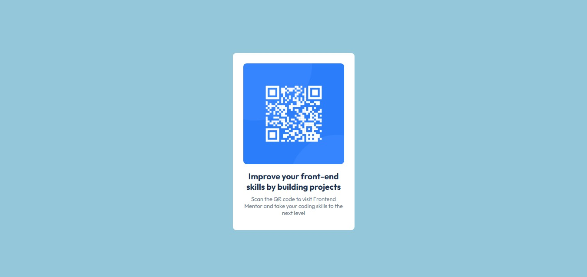

# Frontend Mentor - QR code component solution

This is a solution to the [QR code component challenge on Frontend Mentor](https://www.frontendmentor.io/challenges/qr-code-component-iux_sIO_H). Frontend Mentor challenges help you improve your coding skills by building realistic projects. 

## Table of contents
  - [Screenshot](#screenshot)
  - [Links](#links)
  - [Built with](#built-with)
  - [AI Collaboration](#ai-collaboration)
  - [Author](#author)

### Screenshot

### Links

- Solution URL: http://127.0.0.1:5500/Qr-code%20format.html
- Live Site URL: http://127.0.0.1:5500/Qr-code%20format.html

### Built with
- Semantic HTML5 markup
- CSS custom properties
- Flexbox

### AI Collaboration

I used Visual Studio's AI chat. It helped me detect problems, brainstorm solutions and organize my code properly

## Author

- Frontend Mentor - [@Utibe](https://www.frontendmentor.io/profile/Utibe)

## Acknowledgment
